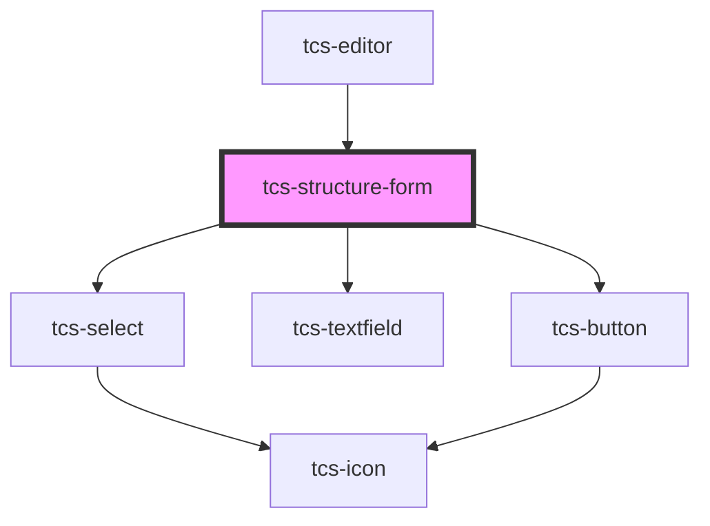

# tcs-structure-form

<!-- Auto Generated Below -->

## Events

| Event        | Description | Type                                                                           |
| ------------ | ----------- | ------------------------------------------------------------------------------ |
| `formChange` |             | `CustomEvent<{ type: UnionStructureType \| "anonymous-block"; ref: string; }>` |
| `formSubmit` |             | `CustomEvent<{ type: UnionStructureType \| "anonymous-block"; ref: string; }>` |

## Methods

### `isValid() => Promise<boolean>`

#### Returns

Type: `Promise<boolean>`

## Dependencies

### Used by

 - [tcs-editor](../../tcs-editor)

### Depends on

- [tcs-select](../../tcs-select)
- [tcs-textfield](../../tcs-textfield)
- [tcs-button](../../tcs-button)

### Graph

----------------------------------------------

*Built with [StencilJS](https://stenciljs.com/)*
