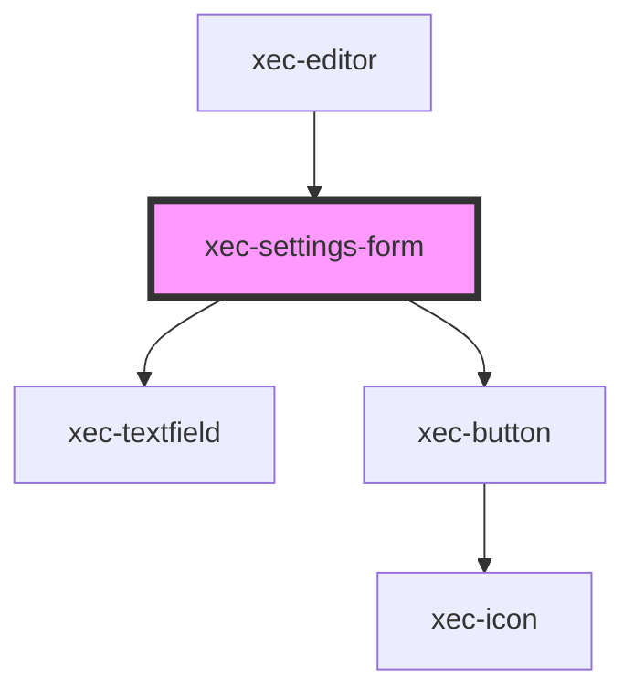

# xec-settings-form

<!-- Auto Generated Below -->

## Properties

| Property        | Attribute | Description | Type                                                  | Default     |
| --------------- | --------- | ----------- | ----------------------------------------------------- | ----------- |
| `defaultValues` | --        |             | `{ column?: string; folio?: string; book?: string; }` | `undefined` |

## Events

| Event        | Description | Type                                                               |
| ------------ | ----------- | ------------------------------------------------------------------ |
| `formChange` |             | `CustomEvent<{ column?: string; folio?: string; book?: string; }>` |
| `formSubmit` |             | `CustomEvent<{ column?: string; folio?: string; book?: string; }>` |

## Methods

### `isValid() => Promise<boolean>`

#### Returns

Type: `Promise<boolean>`

## Dependencies

### Used by

 - [xec-editor](../../xec-editor)

### Depends on

- [xec-textfield](../../xec-textfield)
- [xec-button](../../xec-button)

### Graph

----------------------------------------------

*Built with [StencilJS](https://stenciljs.com/)*
