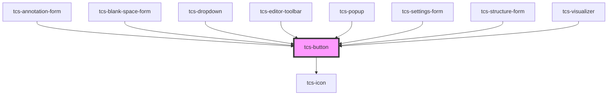

# tcs-button

<!-- Auto Generated Below -->

## Properties

| Property         | Attribute          | Description | Type                                                                                                                                                                                                                                                                                                                 | Default     |
| ---------------- | ------------------ | ----------- | -------------------------------------------------------------------------------------------------------------------------------------------------------------------------------------------------------------------------------------------------------------------------------------------------------------------- | ----------- |
| `active`         | `active`           |             | `boolean`                                                                                                                                                                                                                                                                                                            | `undefined` |
| `disabled`       | `disabled`         |             | `boolean`                                                                                                                                                                                                                                                                                                            | `undefined` |
| `display`        | `display`          |             | `"default" \| "slim"`                                                                                                                                                                                                                                                                                                | `'default'` |
| `icon`           | `icon`             |             | `"message-code" \| "code-simple" \| "align-left" \| "align-right" \| "text-size" \| "cross" \| "angle-down" \| "paragraph-rtl" \| "paragraph-ltr" \| "white-space" \| "broom" \| "columns" \| "settings" \| "lock" \| "unlock" \| "arrows-h" \| "brightness" \| "contrast" \| "zoom-in" \| "zoom-out" \| "compress"` | `undefined` |
| `iconOnly`       | `icon-only`        |             | `boolean`                                                                                                                                                                                                                                                                                                            | `undefined` |
| `iconPosition`   | `icon-position`    |             | `"leading" \| "trailing"`                                                                                                                                                                                                                                                                                            | `'leading'` |
| `outlined`       | `outlined`         |             | `boolean`                                                                                                                                                                                                                                                                                                            | `undefined` |
| `rotateOnActive` | `rotate-on-active` |             | `boolean`                                                                                                                                                                                                                                                                                                            | `undefined` |
| `rounded`        | `rounded`          |             | `boolean`                                                                                                                                                                                                                                                                                                            | `undefined` |
| `slimText`       | `slim-text`        |             | `string`                                                                                                                                                                                                                                                                                                             | `undefined` |
| `stretched`      | `stretched`        |             | `boolean`                                                                                                                                                                                                                                                                                                            | `undefined` |
| `variation`      | `variation`        |             | `"default"`                                                                                                                                                                                                                                                                                                          | `'default'` |

## Events

| Event         | Description | Type                          |
| ------------- | ----------- | ----------------------------- |
| `clickButton` |             | `CustomEvent<HTMLDivElement>` |

## Dependencies

### Used by

 - [tcs-annotation-form](../forms/tcs-annotation-form)
 - [tcs-blank-space-form](../forms/tcs-blank-space-form)
 - [tcs-dropdown](../tcs-dropdown)
 - [tcs-editor-toolbar](../tcs-editor-toolbar)
 - [tcs-popup](../tcs-popup)
 - [tcs-settings-form](../forms/tcs-settings-form)
 - [tcs-structure-form](../forms/tcs-structure-form)
 - [tcs-visualizer](../tcs-visualizer)

### Depends on

- [tcs-icon](../tcs-icon)

### Graph

----------------------------------------------

*Built with [StencilJS](https://stenciljs.com/)*
