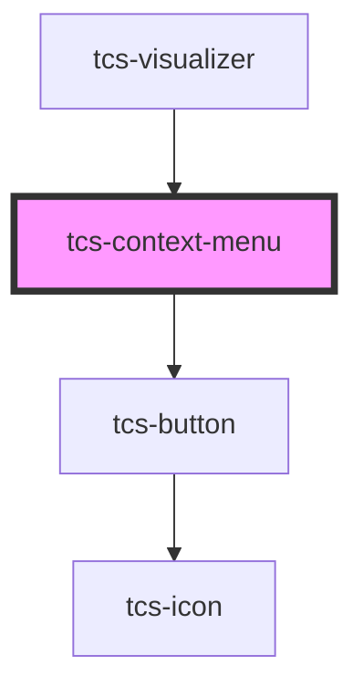

# tcs-context-menu

<!-- Auto Generated Below -->

## Properties

| Property   | Attribute | Description | Type                                                                                                                          | Default     |
| ---------- | --------- | ----------- | ----------------------------------------------------------------------------------------------------------------------------- | ----------- |
| `controls` | --        |             | `{ label: string; onClick?: (selection: Selection, e: MouseEvent) => any; data?: Record<string, any>; icon?: UnionIcons; }[]` | `undefined` |

## Methods

### `close() => Promise<void>`

#### Returns

Type: `Promise<void>`

### `open(x: number, y: number) => Promise<void>`

#### Parameters

| Name | Type     | Description |
| ---- | -------- | ----------- |
| `x`  | `number` |             |
| `y`  | `number` |             |

#### Returns

Type: `Promise<void>`

## Dependencies

### Used by

 - [tcs-visualizer](../tcs-visualizer)

### Depends on

- [tcs-button](../tcs-button)

### Graph

----------------------------------------------

*Built with [StencilJS](https://stenciljs.com/)*
