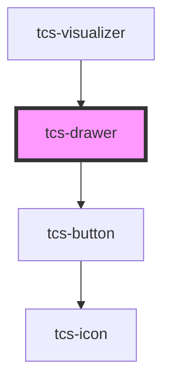

# tcs-drawer

<!-- Auto Generated Below -->

## Properties

| Property   | Attribute  | Description | Type     | Default     |
| ---------- | ---------- | ----------- | -------- | ----------- |
| `html`     | `html`     |             | `string` | `undefined` |
| `markdown` | `markdown` |             | `string` | `undefined` |

## Methods

### `close() => Promise<void>`

#### Returns

Type: `Promise<void>`

### `open() => Promise<void>`

#### Returns

Type: `Promise<void>`

## Dependencies

### Used by

 - [tcs-visualizer](../tcs-visualizer)

### Depends on

- [tcs-button](../tcs-button)

### Graph

----------------------------------------------

*Built with [StencilJS](https://stenciljs.com/)*
