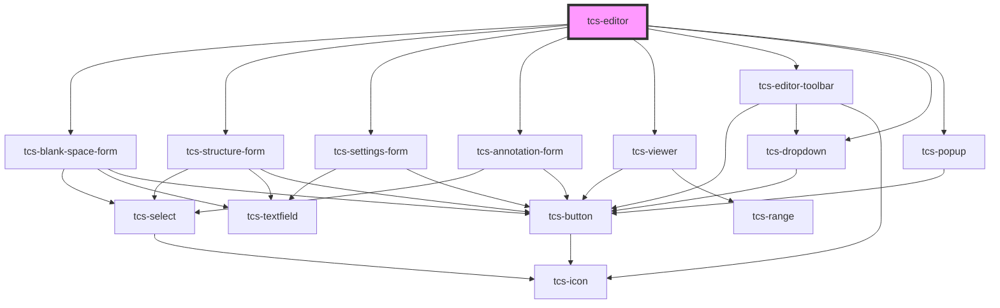

# tcs-editor

<!-- Auto Generated Below -->

## Properties

| Property        | Attribute | Description             | Type                                                                                                                                                                                                                                                                                                                                                                                    | Default                      |
| --------------- | --------- | ----------------------- | --------------------------------------------------------------------------------------------------------------------------------------------------------------------------------------------------------------------------------------------------------------------------------------------------------------------------------------------------------------------------------------- | ---------------------------- |
| `settings`      | --        | Initial editor settings | `{ manuscript?: { column?: string; folio?: string; book?: string; }; }`                                                                                                                                                                                                                                                                                                                 | `defaultEditorSettings`      |
| `toolbarConfig` | --        | Toolbar configuration   | `{ controls: { settings?: boolean; reconstruction?: boolean; annotation?: boolean; layout?: boolean; remove?: boolean; structure?: boolean; blankSpace?: boolean; punctuation?: boolean; abbreviation?: boolean; deleted?: boolean; highlighted?: boolean; unclear?: boolean; viewRaw?: boolean; textDirection?: boolean; textSize?: boolean; viewer?: boolean; expand?: boolean; }; }` | `defaultEditorToolbarConfig` |

## Events

| Event          | Description                           | Type                   |
| -------------- | ------------------------------------- | ---------------------- |
| `expandChange` | Whether the editor is expanded or not | `CustomEvent<boolean>` |

## Methods

### `getFormattedTEI() => Promise<EditorFormattedTEI>`

Get the current formatted TEI for each editor

#### Returns

Type: `Promise<EditorFormattedTEI>`

### `getQuillInstances() => Promise<Map<UnionEditorType, QuillInstance>>`

Get all editors Quill instances

#### Returns

Type: `Promise<Map<UnionEditorType, Quill>>`

### `getSettings() => Promise<EditorSettings>`

Get editor settings

#### Returns

Type: `Promise<EditorSettings>`

### `lock() => Promise<void>`

Lock the editor, the user can't edit the text anymore

#### Returns

Type: `Promise<void>`

### `setDocumentViewerImage(source: OpenSeadragon.TileSourceOptions) => Promise<void>`

Set the document viewer image

#### Parameters

| Name     | Type                | Description |
| -------- | ------------------- | ----------- |
| `source` | `TileSourceOptions` |             |

#### Returns

Type: `Promise<void>`

### `setFormattedTEI(tei: EditorFormattedTEI) => Promise<void>`

Set formatted TEI for each editor

#### Parameters

| Name  | Type                                                                                          | Description |
| ----- | --------------------------------------------------------------------------------------------- | ----------- |
| `tei` | `{ transcribe?: string; translate?: string; comment_line?: string; comment_verse?: string; }` |             |

#### Returns

Type: `Promise<void>`

### `unlock() => Promise<void>`

Unlock the editor, the user can edit the text again

#### Returns

Type: `Promise<void>`

## Dependencies

### Depends on

- [tcs-blank-space-form](../forms/tcs-blank-space-form)
- [tcs-structure-form](../forms/tcs-structure-form)
- [tcs-settings-form](../forms/tcs-settings-form)
- [tcs-annotation-form](../forms/tcs-annotation-form)
- [tcs-viewer](../tcs-viewer)
- [tcs-editor-toolbar](../tcs-editor-toolbar)
- [tcs-dropdown](../tcs-dropdown)
- [tcs-popup](../tcs-popup)

### Graph

----------------------------------------------

*Built with [StencilJS](https://stenciljs.com/)*
