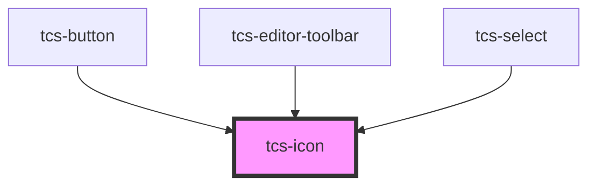

# tcs-icon

<!-- Auto Generated Below -->

## Properties

| Property  | Attribute  | Description | Type                                                                                                                                                                                                                                                                                                                 | Default     |
| --------- | ---------- | ----------- | -------------------------------------------------------------------------------------------------------------------------------------------------------------------------------------------------------------------------------------------------------------------------------------------------------------------- | ----------- |
| `icon`    | `icon`     |             | `"message-code" \| "code-simple" \| "align-left" \| "align-right" \| "text-size" \| "cross" \| "angle-down" \| "paragraph-rtl" \| "paragraph-ltr" \| "white-space" \| "broom" \| "columns" \| "settings" \| "lock" \| "unlock" \| "arrows-h" \| "brightness" \| "contrast" \| "zoom-in" \| "zoom-out" \| "compress"` | `undefined` |
| `library` | `library`  |             | `string`                                                                                                                                                                                                                                                                                                             | `undefined` |
| `viewBox` | `view-box` |             | `string`                                                                                                                                                                                                                                                                                                             | `undefined` |

## Events

| Event       | Description | Type                      |
| ----------- | ----------- | ------------------------- |
| `clickIcon` |             | `CustomEvent<SVGElement>` |

## Dependencies

### Used by

 - [tcs-button](../tcs-button)
 - [tcs-editor-toolbar](../tcs-editor-toolbar)
 - [tcs-select](../tcs-select)

### Graph

----------------------------------------------

*Built with [StencilJS](https://stenciljs.com/)*
