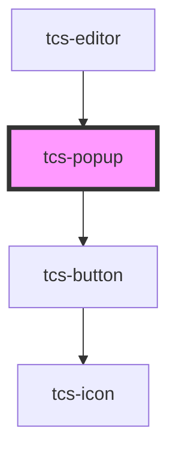

# tcs-popup

<!-- Auto Generated Below -->

## Methods

### `closePopup() => Promise<void>`

#### Returns

Type: `Promise<void>`

### `openPopup() => Promise<void>`

#### Returns

Type: `Promise<void>`

### `setContent(content: string) => Promise<void>`

#### Parameters

| Name      | Type     | Description |
| --------- | -------- | ----------- |
| `content` | `string` |             |

#### Returns

Type: `Promise<void>`

## Dependencies

### Used by

 - [tcs-editor](../tcs-editor)

### Depends on

- [tcs-button](../tcs-button)

### Graph

----------------------------------------------

*Built with [StencilJS](https://stenciljs.com/)*
