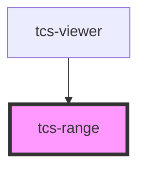

# tcs-range

<!-- Auto Generated Below -->

## Properties

| Property         | Attribute         | Description | Type      | Default     |
| ---------------- | ----------------- | ----------- | --------- | ----------- |
| `debounce`       | `debounce`        |             | `number`  | `undefined` |
| `defaultValue`   | `default-value`   |             | `number`  | `undefined` |
| `max`            | `max`             |             | `number`  | `100`       |
| `min`            | `min`             |             | `number`  | `0`         |
| `precision`      | `precision`       |             | `number`  | `undefined` |
| `readOnly`       | `read-only`       |             | `boolean` | `false`     |
| `showRangeMax`   | `show-range-max`  |             | `boolean` | `false`     |
| `showRangeMin`   | `show-range-min`  |             | `boolean` | `false`     |
| `stylesOverride` | `styles-override` |             | `string`  | `undefined` |

## Events

| Event         | Description | Type                  |
| ------------- | ----------- | --------------------- |
| `rangeChange` |             | `CustomEvent<number>` |

## Methods

### `reset() => Promise<void>`

#### Returns

Type: `Promise<void>`

## Dependencies

### Used by

 - [tcs-viewer](../tcs-viewer)

### Graph

----------------------------------------------

*Built with [StencilJS](https://stenciljs.com/)*
