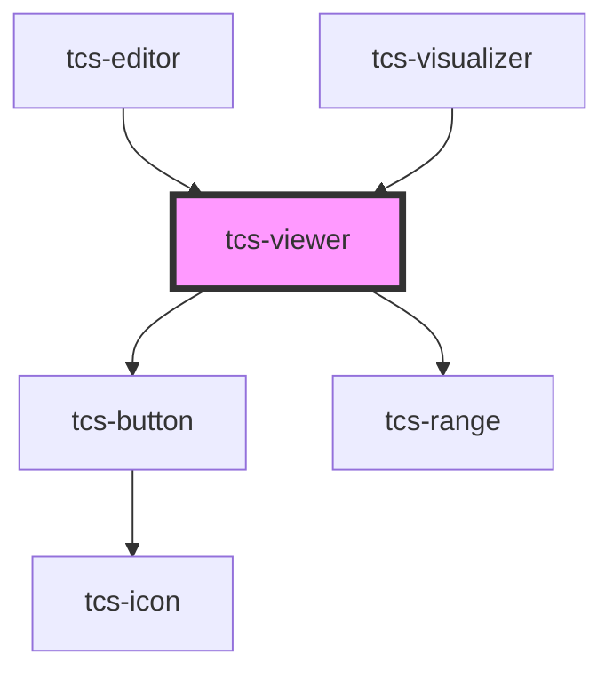

# tcs-viewer

<!-- Auto Generated Below -->

## Methods

### `setDocumentViewerImage(source: OpenSeadragon.TileSourceOptions) => Promise<void>`

#### Parameters

| Name     | Type                | Description |
| -------- | ------------------- | ----------- |
| `source` | `TileSourceOptions` |             |

#### Returns

Type: `Promise<void>`

## Dependencies

### Used by

 - [tcs-editor](../tcs-editor)
 - [tcs-visualizer](../tcs-visualizer)

### Depends on

- [tcs-button](../tcs-button)
- [tcs-range](../tcs-range)

### Graph

----------------------------------------------

*Built with [StencilJS](https://stenciljs.com/)*
