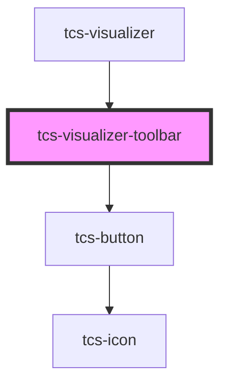

# tcs-visualizer-toolbar

<!-- Auto Generated Below -->

## Properties

| Property     | Attribute     | Description | Type                                   | Default     |
| ------------ | ------------- | ----------- | -------------------------------------- | ----------- |
| `config`     | --            |             | `{ controls: { layout?: boolean; }; }` | `undefined` |
| `layoutType` | `layout-type` |             | `"columns" \| "mix" \| "rows"`         | `'rows'`    |

## Events

| Event           | Description | Type                                        |
| --------------- | ----------- | ------------------------------------------- |
| `clickExpand`   |             | `CustomEvent<void>`                         |
| `clickLayout`   |             | `CustomEvent<"columns" \| "mix" \| "rows">` |
| `clickTextSize` |             | `CustomEvent<void>`                         |
| `clickViewer`   |             | `CustomEvent<void>`                         |

## Dependencies

### Used by

 - [tcs-visualizer](../tcs-visualizer)

### Depends on

- [tcs-button](../tcs-button)

### Graph

----------------------------------------------

*Built with [StencilJS](https://stenciljs.com/)*
