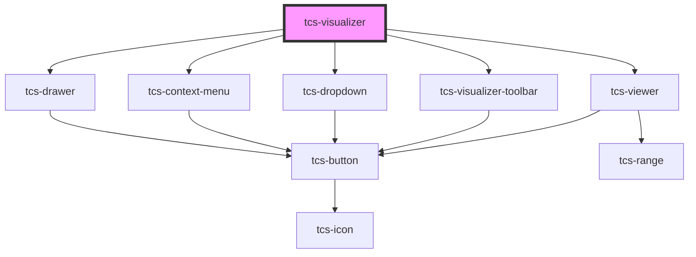

# tcs-visualizer

<!-- Auto Generated Below -->

## Properties

| Property           | Attribute | Description                      | Type                                                                                                                          | Default                          |
| ------------------ | --------- | -------------------------------- | ----------------------------------------------------------------------------------------------------------------------------- | -------------------------------- |
| `contextMenuLinks` | --        | Links to add to the context menu | `{ label: string; onClick?: (selection: Selection, e: MouseEvent) => any; data?: Record<string, any>; icon?: UnionIcons; }[]` | `[]`                             |
| `tei`              | --        | TEI to display for each editor   | `{ transcribe?: string; translate?: string; comment_line?: string; comment_verse?: string; }`                                 | `undefined`                      |
| `toolbarConfig`    | --        | Toolbar configuration            | `{ controls: { layout?: boolean; }; }`                                                                                        | `defaultVisualizerToolbarConfig` |

## Events

| Event          | Description                               | Type                   |
| -------------- | ----------------------------------------- | ---------------------- |
| `expandChange` | Whether the visualizer is expanded or not | `CustomEvent<boolean>` |

## Methods

### `getDrawer() => Promise<HTMLTcsDrawerElement>`

Get the drawer element

#### Returns

Type: `Promise<HTMLTcsDrawerElement>`

### `setDocumentViewerImage(source: OpenSeadragon.TileSourceOptions) => Promise<void>`

Set the document viewer image

#### Parameters

| Name     | Type                | Description |
| -------- | ------------------- | ----------- |
| `source` | `TileSourceOptions` |             |

#### Returns

Type: `Promise<void>`

## Dependencies

### Depends on

- [tcs-viewer](../tcs-viewer)
- [tcs-visualizer-toolbar](../tcs-visualizer-toolbar)
- [tcs-dropdown](../tcs-dropdown)
- [tcs-context-menu](../tcs-context-menu)
- [tcs-drawer](../tcs-drawer)

### Graph

----------------------------------------------

*Built with [StencilJS](https://stenciljs.com/)*
