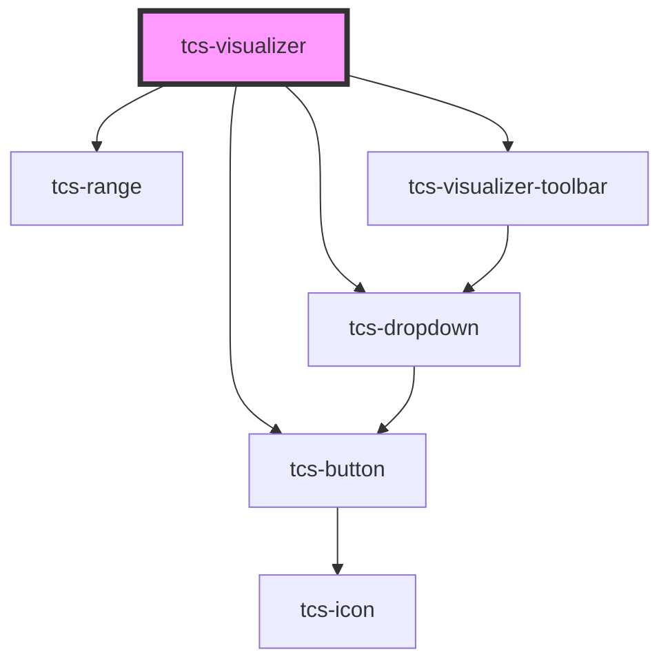

# tcs-visualizer

<!-- Auto Generated Below -->

## Properties

| Property        | Attribute | Description | Type                                   | Default                          |
| --------------- | --------- | ----------- | -------------------------------------- | -------------------------------- |
| `toolbarConfig` | --        |             | `{ controls: { layout?: boolean; }; }` | `defaultVisualizerToolbarConfig` |

## Methods

### `setDocumentViewerImage(source: OpenSeadragon.TileSourceOptions) => Promise<void>`

#### Parameters

| Name     | Type                | Description |
| -------- | ------------------- | ----------- |
| `source` | `TileSourceOptions` |             |

#### Returns

Type: `Promise<void>`

## Dependencies

### Depends on

- [tcs-button](../tcs-button)
- [tcs-range](../tcs-range)
- [tcs-visualizer-toolbar](../tcs-visualizer-toolbar)
- [tcs-dropdown](../tcs-dropdown)

### Graph

----------------------------------------------

*Built with [StencilJS](https://stenciljs.com/)*
