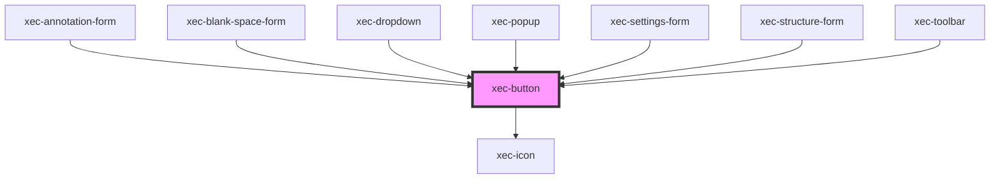

# xec-button

<!-- Auto Generated Below -->

## Properties

| Property         | Attribute          | Description | Type                                                                                                                                                                                                             | Default     |
| ---------------- | ------------------ | ----------- | ---------------------------------------------------------------------------------------------------------------------------------------------------------------------------------------------------------------- | ----------- |
| `active`         | `active`           |             | `boolean`                                                                                                                                                                                                        | `undefined` |
| `disabled`       | `disabled`         |             | `boolean`                                                                                                                                                                                                        | `undefined` |
| `icon`           | `icon`             |             | `"align-left" \| "align-right" \| "angle-down" \| "broom" \| "code-simple" \| "columns" \| "cross" \| "lock" \| "message-code" \| "paragraph-ltr" \| "paragraph-rtl" \| "settings" \| "unlock" \| "white-space"` | `undefined` |
| `iconOnly`       | `icon-only`        |             | `boolean`                                                                                                                                                                                                        | `undefined` |
| `iconPosition`   | `icon-position`    |             | `"leading" \| "trailing"`                                                                                                                                                                                        | `'leading'` |
| `outlined`       | `outlined`         |             | `boolean`                                                                                                                                                                                                        | `undefined` |
| `rotateOnActive` | `rotate-on-active` |             | `boolean`                                                                                                                                                                                                        | `undefined` |
| `rounded`        | `rounded`          |             | `boolean`                                                                                                                                                                                                        | `undefined` |
| `stretched`      | `stretched`        |             | `boolean`                                                                                                                                                                                                        | `undefined` |
| `variation`      | `variation`        |             | `"default"`                                                                                                                                                                                                      | `'default'` |

## Events

| Event         | Description | Type                          |
| ------------- | ----------- | ----------------------------- |
| `clickButton` |             | `CustomEvent<HTMLDivElement>` |

## Dependencies

### Used by

 - [xec-annotation-form](../forms/xec-annotation-form)
 - [xec-blank-space-form](../forms/xec-blank-space-form)
 - [xec-dropdown](../xec-dropdown)
 - [xec-popup](../xec-popup)
 - [xec-settings-form](../forms/xec-settings-form)
 - [xec-structure-form](../forms/xec-structure-form)
 - [xec-toolbar](../xec-toolbar)

### Depends on

- [xec-icon](../xec-icon)

### Graph

----------------------------------------------

*Built with [StencilJS](https://stenciljs.com/)*
