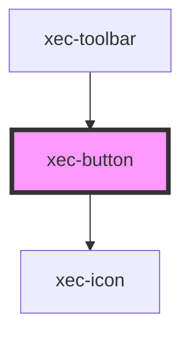

# xec-button

<!-- Auto Generated Below -->

## Properties

| Property    | Attribute   | Description | Type                            | Default     |
| ----------- | ----------- | ----------- | ------------------------------- | ----------- |
| `icon`      | `icon`      |             | `"arrow-left" \| "arrow-right"` | `undefined` |
| `variation` | `variation` |             | `"default"`                     | `'default'` |

## Events

| Event         | Description | Type                          |
| ------------- | ----------- | ----------------------------- |
| `clickButton` |             | `CustomEvent<HTMLDivElement>` |

## Dependencies

### Used by

 - [xec-toolbar](../xec-toolbar)

### Depends on

- [xec-icon](../xec-icon)

### Graph

----------------------------------------------

*Built with [StencilJS](https://stenciljs.com/)*
