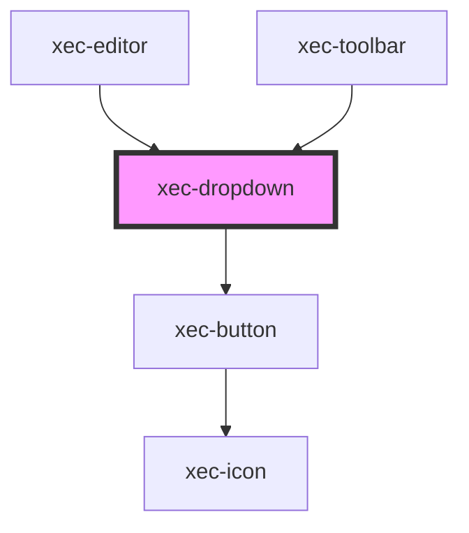

# xec-dropdown

<!-- Auto Generated Below -->

## Properties

| Property   | Attribute   | Description | Type                                        | Default                                              |
| ---------- | ----------- | ----------- | ------------------------------------------- | ---------------------------------------------------- |
| `config`   | --          |             | `{ label: string; items: DropdownItem[]; }` | `{     label: '__dropdown_label',     items: []   }` |
| `disabled` | `disabled`  |             | `boolean`                                   | `false`                                              |
| `display`  | `display`   |             | `"default" \| "slim"`                       | `'default'`                                          |
| `slimText` | `slim-text` |             | `string`                                    | `undefined`                                          |

## Methods

### `close() => Promise<void>`

#### Returns

Type: `Promise<void>`

### `open() => Promise<void>`

#### Returns

Type: `Promise<void>`

## Dependencies

### Used by

 - [xec-editor](../xec-editor)
 - [xec-toolbar](../xec-toolbar)

### Depends on

- [xec-button](../xec-button)

### Graph

----------------------------------------------

*Built with [StencilJS](https://stenciljs.com/)*
