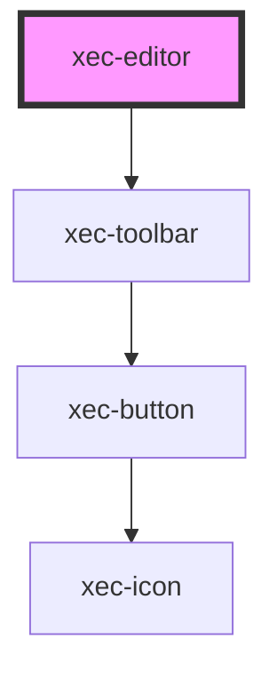

# xec-editor

<!-- Auto Generated Below -->

## Properties

| Property | Attribute | Description | Type                                    | Default                |
| -------- | --------- | ----------- | --------------------------------------- | ---------------------- |
| `config` | --        |             | `{ controls: { viewRaw?: boolean; }; }` | `defaultToolbarConfig` |

## Methods

### `getQuillInstance() => Promise<QuillInstance>`

#### Returns

Type: `Promise<Quill>`

## Dependencies

### Depends on

- [xec-toolbar](../xec-toolbar)

### Graph

----------------------------------------------

*Built with [StencilJS](https://stenciljs.com/)*
