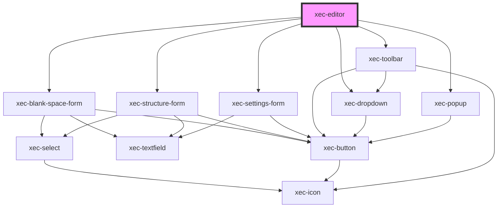

# xec-editor

<!-- Auto Generated Below -->

## Properties

| Property        | Attribute | Description | Type                                                                                                                                                                                                                                                                            | Default                 |
| --------------- | --------- | ----------- | ------------------------------------------------------------------------------------------------------------------------------------------------------------------------------------------------------------------------------------------------------------------------------- | ----------------------- |
| `settings`      | --        |             | `{ manuscript?: { column?: string; folio?: string; book?: string; }; }`                                                                                                                                                                                                         | `defaultEditorSettings` |
| `toolbarConfig` | --        |             | `{ controls: { settings?: boolean; layout?: boolean; remove?: boolean; structure?: boolean; blankSpace?: boolean; punctuation?: boolean; abbreviation?: boolean; deleted?: boolean; highlighted?: boolean; unclear?: boolean; viewRaw?: boolean; textDirection?: boolean; }; }` | `defaultToolbarConfig`  |

## Methods

### `getFormattedTEI() => Promise<EditorFormattedTEI>`

#### Returns

Type: `Promise<EditorFormattedTEI>`

### `getQuillInstances() => Promise<Map<UnionEditorType, QuillInstance>>`

#### Returns

Type: `Promise<Map<UnionEditorType, Quill>>`

### `getSettings() => Promise<EditorSettings>`

#### Returns

Type: `Promise<EditorSettings>`

### `lock() => Promise<void>`

#### Returns

Type: `Promise<void>`

### `setFormattedTEI(tei: EditorFormattedTEI) => Promise<void>`

#### Parameters

| Name  | Type                                                                                          | Description |
| ----- | --------------------------------------------------------------------------------------------- | ----------- |
| `tei` | `{ transcribe?: string; translate?: string; comment_line?: string; comment_verse?: string; }` |             |

#### Returns

Type: `Promise<void>`

### `unlock() => Promise<void>`

#### Returns

Type: `Promise<void>`

## Dependencies

### Depends on

- [xec-blank-space-form](../forms/xec-blank-space-form)
- [xec-structure-form](../forms/xec-structure-form)
- [xec-settings-form](../forms/xec-settings-form)
- [xec-toolbar](../xec-toolbar)
- [xec-dropdown](../xec-dropdown)
- [xec-popup](../xec-popup)

### Graph

----------------------------------------------

*Built with [StencilJS](https://stenciljs.com/)*
