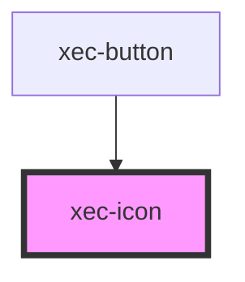

# xec-icon

<!-- Auto Generated Below -->

## Properties

| Property  | Attribute  | Description | Type                            | Default     |
| --------- | ---------- | ----------- | ------------------------------- | ----------- |
| `icon`    | `icon`     |             | `"arrow-left" \| "arrow-right"` | `undefined` |
| `library` | `library`  |             | `string`                        | `undefined` |
| `viewBox` | `view-box` |             | `string`                        | `undefined` |

## Events

| Event       | Description | Type                      |
| ----------- | ----------- | ------------------------- |
| `clickIcon` |             | `CustomEvent<SVGElement>` |

## Dependencies

### Used by

 - [xec-button](../xec-button)

### Graph

----------------------------------------------

*Built with [StencilJS](https://stenciljs.com/)*
