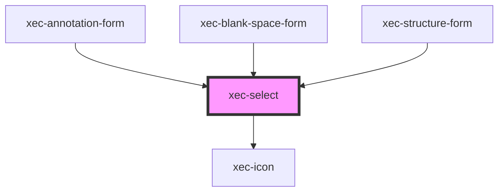

# xec-select

<!-- Auto Generated Below -->

## Properties

| Property      | Attribute     | Description | Type               | Default     |
| ------------- | ------------- | ----------- | ------------------ | ----------- |
| `entries`     | --            |             | `XecSelectEntry[]` | `[]`        |
| `inputId`     | `input-id`    |             | `string`           | `undefined` |
| `inputName`   | `input-name`  |             | `string`           | `undefined` |
| `placeholder` | `placeholder` |             | `string`           | `undefined` |
| `required`    | `required`    |             | `boolean`          | `undefined` |

## Events

| Event          | Description | Type                                                                         |
| -------------- | ----------- | ---------------------------------------------------------------------------- |
| `selectChange` |             | `CustomEvent<{ label: string; id: string \| number; normalized?: string; }>` |

## Methods

### `getValue() => Promise<string | number>`

#### Returns

Type: `Promise<string | number>`

### `isValid() => Promise<boolean>`

#### Returns

Type: `Promise<boolean>`

### `setValue(value: string) => Promise<void>`

#### Parameters

| Name    | Type     | Description |
| ------- | -------- | ----------- |
| `value` | `string` |             |

#### Returns

Type: `Promise<void>`

## Dependencies

### Used by

 - [xec-annotation-form](../forms/xec-annotation-form)
 - [xec-blank-space-form](../forms/xec-blank-space-form)
 - [xec-structure-form](../forms/xec-structure-form)

### Depends on

- [xec-icon](../xec-icon)

### Graph

----------------------------------------------

*Built with [StencilJS](https://stenciljs.com/)*
