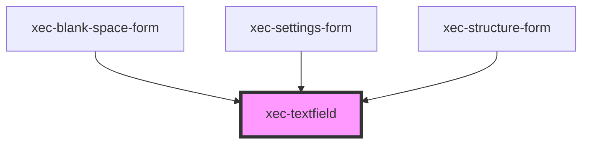

# xec-textfield

<!-- Auto Generated Below -->

## Properties

| Property        | Attribute       | Description | Type                                          | Default     |
| --------------- | --------------- | ----------- | --------------------------------------------- | ----------- |
| `allowedValues` | --              |             | `(string \| number)[]`                        | `undefined` |
| `defaultValue`  | `default-value` |             | `string`                                      | `undefined` |
| `inputId`       | `input-id`      |             | `string`                                      | `undefined` |
| `inputName`     | `input-name`    |             | `string`                                      | `undefined` |
| `integer`       | `integer`       |             | `boolean`                                     | `undefined` |
| `max`           | `max`           |             | `number`                                      | `undefined` |
| `min`           | `min`           |             | `number`                                      | `undefined` |
| `pattern`       | `pattern`       |             | `string`                                      | `undefined` |
| `placeholder`   | `placeholder`   |             | `string`                                      | `undefined` |
| `required`      | `required`      |             | `boolean`                                     | `undefined` |
| `type`          | `type`          |             | `"email" \| "number" \| "password" \| "text"` | `'text'`    |

## Events

| Event             | Description | Type                  |
| ----------------- | ----------- | --------------------- |
| `textfieldChange` |             | `CustomEvent<string>` |

## Methods

### `getValue() => Promise<string>`

#### Returns

Type: `Promise<string>`

### `isValid() => Promise<boolean>`

#### Returns

Type: `Promise<boolean>`

### `setValue(value: string) => Promise<void>`

#### Parameters

| Name    | Type     | Description |
| ------- | -------- | ----------- |
| `value` | `string` |             |

#### Returns

Type: `Promise<void>`

## Dependencies

### Used by

 - [xec-blank-space-form](../forms/xec-blank-space-form)
 - [xec-settings-form](../forms/xec-settings-form)
 - [xec-structure-form](../forms/xec-structure-form)

### Graph

----------------------------------------------

*Built with [StencilJS](https://stenciljs.com/)*
