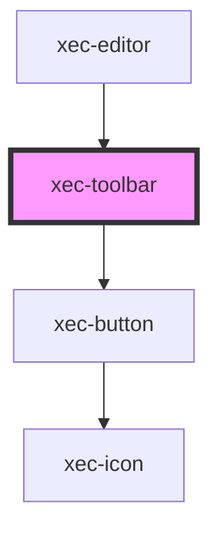

# xec-toolbar

<!-- Auto Generated Below -->

## Properties

| Property | Attribute | Description | Type                                    | Default     |
| -------- | --------- | ----------- | --------------------------------------- | ----------- |
| `config` | --        |             | `{ controls: { viewRaw?: boolean; }; }` | `undefined` |

## Dependencies

### Used by

 - [xec-editor](../xec-editor)

### Depends on

- [xec-button](../xec-button)

### Graph

----------------------------------------------

*Built with [StencilJS](https://stenciljs.com/)*
