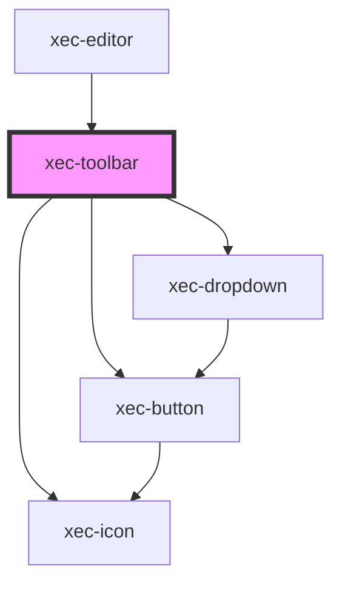

# xec-toolbar

<!-- Auto Generated Below -->

## Properties

| Property        | Attribute        | Description | Type                                                                                                                                                                                                                                                                                                                            | Default     |
| --------------- | ---------------- | ----------- | ------------------------------------------------------------------------------------------------------------------------------------------------------------------------------------------------------------------------------------------------------------------------------------------------------------------------------- | ----------- |
| `config`        | --               |             | `{ controls: { settings?: boolean; reconstruction?: boolean; annotation?: boolean; layout?: boolean; remove?: boolean; structure?: boolean; blankSpace?: boolean; punctuation?: boolean; abbreviation?: boolean; deleted?: boolean; highlighted?: boolean; unclear?: boolean; viewRaw?: boolean; textDirection?: boolean; }; }` | `undefined` |
| `disabled`      | `disabled`       |             | `boolean`                                                                                                                                                                                                                                                                                                                       | `false`     |
| `layoutType`    | `layout-type`    |             | `"columns" \| "tabs"`                                                                                                                                                                                                                                                                                                           | `'columns'` |
| `locked`        | `locked`         |             | `boolean`                                                                                                                                                                                                                                                                                                                       | `false`     |
| `textDirection` | `text-direction` |             | `"LTR" \| "RTL"`                                                                                                                                                                                                                                                                                                                | `'LTR'`     |
| `viewRaw`       | `view-raw`       |             | `boolean`                                                                                                                                                                                                                                                                                                                       | `false`     |

## Events

| Event                 | Description | Type                                                                                                                         |
| --------------------- | ----------- | ---------------------------------------------------------------------------------------------------------------------------- |
| `clickAbbreviation`   |             | `CustomEvent<"nomSac" \| "other">`                                                                                           |
| `clickAnnotation`     |             | `CustomEvent<void>`                                                                                                          |
| `clickBlankSpace`     |             | `CustomEvent<void>`                                                                                                          |
| `clickDeleted`        |             | `CustomEvent<"dotted" \| "erased" \| "other" \| "strikethrough" \| "underline">`                                             |
| `clickHighlighted`    |             | `CustomEvent<"bigger" \| "displaced-above" \| "displaced-below" \| "doted" \| "enlarged" \| "infralinear" \| "supralinear">` |
| `clickLayout`         |             | `CustomEvent<void>`                                                                                                          |
| `clickLTR`            |             | `CustomEvent<void>`                                                                                                          |
| `clickPunctuation`    |             | `CustomEvent<string>`                                                                                                        |
| `clickReconstruction` |             | `CustomEvent<"illegible" \| "lacuna" \| "unspecified">`                                                                      |
| `clickRemove`         |             | `CustomEvent<void>`                                                                                                          |
| `clickRTL`            |             | `CustomEvent<void>`                                                                                                          |
| `clickSettings`       |             | `CustomEvent<void>`                                                                                                          |
| `clickStructure`      |             | `CustomEvent<"anonymous-block" \| "book" \| "chapter" \| "inscriptio" \| "subscriptio" \| "verse">`                          |
| `clickUnclear`        |             | `CustomEvent<"background_noise" \| "faded" \| "legible_incomplete" \| "uncertain">`                                          |
| `clickViewRaw`        |             | `CustomEvent<void>`                                                                                                          |

## Dependencies

### Used by

 - [xec-editor](../xec-editor)

### Depends on

- [xec-button](../xec-button)
- [xec-dropdown](../xec-dropdown)
- [xec-icon](../xec-icon)

### Graph

----------------------------------------------

*Built with [StencilJS](https://stenciljs.com/)*
